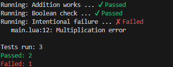

# super simple lua testing in one file.

## example usage:

```lua
local Test = require("test")

Test.add("Addition works", function()
    Test.assertEquals(1 + 1, 2)
end)

Test.add("Boolean check", function()
    Test.assertTrue(5 > 3)
end)

Test.add("Intentional failure", function()
    Test.assertEquals(2 * 2, 5, "Multiplication error")
end)

Test.run()
```

# should result in:


